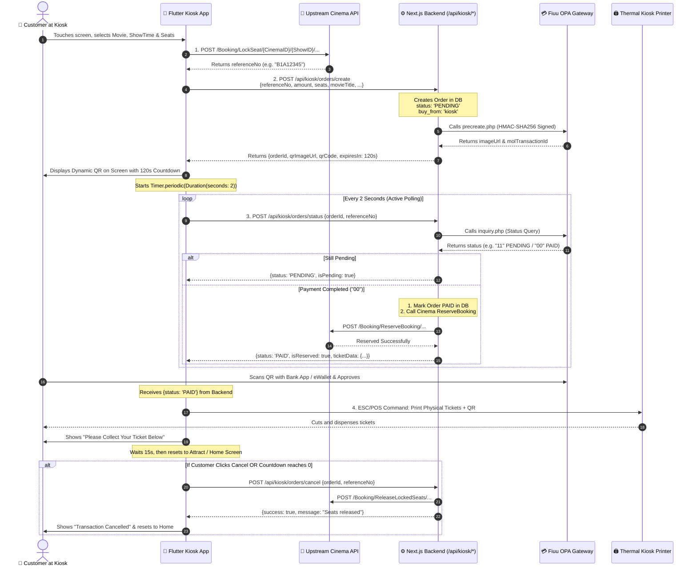

# MS Cinema Kiosk API Documentation

This document provides a comprehensive technical guide for integrating the **MS Cinema Self-Service Kiosk Application** (Flutter / Client) with the **MS Cinema Next.js Backend** and **Fiuu (Razer Merchant Services) Offline Payment API (OPA)**.

---

## Table of Contents
1. [Overview & Architecture](#1-overview--architecture)
2. [Base URLs & Environment Management](#2-base-urls--environment-management)
3. [End-to-End Workflow](#3-end-to-end-workflow)
4. [API Endpoints](#4-api-endpoints)
   - [1. Create Kiosk Order & PreCreate QR](#1-create-kiosk-order--precreate-qr)
   - [2. Inquire Order & Payment Status](#2-inquire-order--payment-status)
   - [3. Cancel Order & Release Locked Seats](#3-cancel-order--release-locked-seats)
   - [4. Fiuu Asynchronous Webhook (IPN)](#4-fiuu-asynchronous-webhook-ipn)
5. [Card Payment Integration (CardBiz UPT1000 EDC)](#5-card-payment-integration-cardbiz-upt1000-edc)
6. [Fault Tolerance & Auto-Reversal](#6-fault-tolerance--auto-reversal)
7. [Thermal Ticket Printing Payload](#7-thermal-ticket-printing-payload)

---

## 1. Overview & Architecture

The Kiosk system allows moviegoers to select movies, showtimes, and seats on a touch screen, pay using dynamic QR (DuitNow, Touch 'n Go, Boost, GrabPay, Maybank QRPay) or Credit/Debit Card (CardBiz UPT1000 terminal), and receive printed physical tickets.

```
┌─────────────────────────┐
│   Kiosk Touch Screen    │
│      (Flutter App)      │
└────────────┬────────────┘
             │ 1. Lock Seats via Cinema API
             │ 2. Create Order & Get QR
             ▼
┌─────────────────────────┐        PreCreate QR        ┌─────────────────────────┐
│   MS Cinema Backend     ├───────────────────────────►│    Fiuu Gateway (OPA)   │
│       (Next.js)         │◄───────────────────────────┤   (Sandbox / Live)      │
└────────────┬────────────┘      Status Inquiry        └─────────────────────────┘
             │
             │ ReserveBooking
             ▼
┌─────────────────────────┐
│   Upstream Cinema API   │
│    (MS Cinema Core)     │
└─────────────────────────┘
```

---

## 2. Base URLs & Environment Management

| Environment | Backend Base URL |
| :--- | :--- |
| **Localhost** | `http://localhost:3000` |
| **Staging (Cloudflare Tunnel)** | `https://staging.mscinemas.my` |
| **Production** | `https://www.mscinemas.my` |

### Environment Variables
Set in `.env.local` (Sandbox) or `.env.production` (Live):
```env
FIUU_OPA_ENV=sandbox # or 'live'
FIUU_OPA_APP_CODE=7b722873a171b69b7e3028b5e3282b40
FIUU_OPA_SECRET_KEY=1ab8ecdea3fa97ee8fe1b3399917544c
FIUU_OPA_STORE_ID=mscinema
FIUU_OPA_MERCHANT_ID=SB_mscinema
```

---

## 3. End-to-End Workflow

1. **Seat Selection**: The Flutter Kiosk app calls the upstream Cinema API to lock seats (`LockSeat`) and gets a `referenceNo` (e.g., `B1A12345`).
2. **Order Initiation**: Flutter app calls `POST /api/kiosk/orders/create`.
   - Backend records the order in the database with `status: 'PENDING'` and `buy_from: 'kiosk'`.
   - Backend generates a Fiuu OPA PreCreate Dynamic QR.
3. **Display QR & Countdown**: Kiosk displays the dynamic QR image with a 120-second countdown.
4. **Active Polling**: Kiosk polls `POST /api/kiosk/orders/status` every 2–3 seconds.
5. **Confirmation & Reservation**:
   - Once payment is confirmed (`00`), backend marks the order `PAID`.
   - Backend calls `ReserveBooking` on the upstream Cinema API.
   - Backend returns complete ticket data to the Kiosk for printing.
6. **Ticket Printing**: Thermal printer prints the physical cinema tickets.

---

## 4. API Endpoints

### 1. Create Kiosk Order & PreCreate QR
Initiates an order and generates the dynamic payment QR code.

- **URL:** `/api/kiosk/orders/create`
- **Method:** `POST`
- **Content-Type:** `application/json`

#### Request Body
```json
{
  "referenceNo": "B1A12345",
  "amount": 25.00,
  "movieTitle": "Jawan",
  "movieId": 105,
  "cinemaName": "MS Cinemas Klang",
  "cinemaId": "1",
  "hallName": "Hall 2",
  "showId": "3542",
  "showTime": "2026-09-03 20:30:00",
  "seats": ["E12", "E13"],
  "ticketType": "Adult",
  "customerName": "Kiosk Customer",
  "customerPhone": "0123456789",
  "customerEmail": "customer@example.com",
  "token": "UPSTREAM_CINEMA_BEARER_TOKEN",
  "terminalId": "KIOSK01",
  "paymentMethod": "FIUU_QR"
}
```

#### Success Response (`200 OK`)
```json
{
  "success": true,
  "orderId": "KSK_B1A12345_366909ABC",
  "referenceNo": "B1A12345",
  "amount": "25.00",
  "molTransactionId": "152688225",
  "imageUrl": "https://sandbox.merchant.razer.com/RMS/API/MOLOPA/qr.php?id=...",
  "qrCode": "00020101021226580014A000000727...",
  "expiresInSeconds": 120,
  "message": "Dynamic QR generated successfully"
}
```

---

### 2. Inquire Order & Payment Status
Polls the payment gateway status and reserves cinema seats once paid.

- **URL:** `/api/kiosk/orders/status`
- **Method:** `POST`
- **Content-Type:** `application/json`

#### Request Body (For QR Payment Polling)
```json
{
  "orderId": "KSK_B1A12345_366909ABC",
  "referenceNo": "B1A12345"
}
```

#### Pending Response (`200 OK`)
```json
{
  "success": true,
  "status": "PENDING",
  "isPending": true,
  "orderId": "KSK_B1A12345_366909ABC"
}
```

#### Success Response (`200 OK` - Payment Confirmed & Seats Reserved)
```json
{
  "success": true,
  "status": "PAID",
  "isReserved": true,
  "orderId": "KSK_B1A12345_366909ABC",
  "referenceNo": "B1A12345",
  "transactionNo": "152688225",
  "amount": "25.00",
  "ticketData": {
    "movieTitle": "Jawan",
    "cinemaName": "MS Cinemas Klang",
    "hallName": "Hall 2",
    "showTime": "2026-09-03T12:30:00.000Z",
    "seats": "E12, E13",
    "referenceNo": "B1A12345",
    "ticketDetails": [
      {
        "seatNo": "E12",
        "type": "Adult",
        "price": 12.50,
        "barcode": "B1A12345001"
      },
      {
        "seatNo": "E13",
        "type": "Adult",
        "price": 12.50,
        "barcode": "B1A12345002"
      }
    ]
  }
}
```

#### Upstream Reserve Failed / Auto-Refunded (`409 Conflict`)
```json
{
  "success": false,
  "status": "RESERVE_FAILED_REFUNDED",
  "error": "Seat reservation failed on cinema system. Your payment has been automatically reversed."
}
```

---

### 3. Cancel Order & Release Locked Seats
Triggered when a customer clicks "Cancel" on screen or when the countdown reaches 0.

- **URL:** `/api/kiosk/orders/cancel`
- **Method:** `POST`
- **Content-Type:** `application/json`

#### Request Body
```json
{
  "orderId": "KSK_B1A12345_366909ABC",
  "referenceNo": "B1A12345",
  "cinemaId": "1",
  "showId": "3542"
}
```

#### Response (`200 OK`)
```json
{
  "success": true,
  "message": "Order cancelled successfully and locked seats released",
  "orderId": "KSK_B1A12345_366909ABC",
  "referenceNo": "B1A12345",
  "upstreamRelease": {
    "success": true
  }
}
```

---

### 4. Fiuu Asynchronous Webhook (IPN)
Receives instant notifications from Fiuu server-to-server.

- **URL:** `/api/kiosk/payment/webhook`
- **Method:** `POST` / `GET`
- **Content-Type:** `application/x-www-form-urlencoded` or `application/json`

Automatically validates the `HMAC-SHA256` signature, marks the order `PAID`, triggers `ReserveBooking`, and logs the event to `PaymentLog`.

---

## 5. Card Payment Integration (CardBiz UPT1000 EDC)

When customer selects **Card Payment**:
1. Kiosk calls `/api/kiosk/orders/create` with `"paymentMethod": "CARDBIZ_EDC"`.
2. Kiosk Flutter app activates the CardBiz terminal via `EDC_Serial_Lib.dll` on COM port (`COM3`, 9600 baud rate).
3. Customer taps/inserts card.
4. When terminal approves (`StatusCode == 0 && ResponseCode == "00"`), Flutter app sends the card approval details directly to `/api/kiosk/orders/status`:

```json
{
  "orderId": "KSK_B1A12345_366909ABC",
  "referenceNo": "B1A12345",
  "cardPaymentResult": {
    "statusCode": 0,
    "responseCode": "00",
    "statusMessage": "APPROVED",
    "approvalCode": "123456",
    "traceNo": "000045",
    "invoiceNo": "000102",
    "cardNo": "411111******1111",
    "cardLabel": "VISA"
  }
}
```
5. Backend verifies the result, marks order `PAID`, reserves seats, and returns ticket printing data.

---

## 6. Fault Tolerance & Auto-Reversal

1. **Automatic Void on Upstream Failure**: If Fiuu charges the customer but the upstream cinema API fails to lock seats, the backend immediately triggers Fiuu's `reversal.php` to void the transaction and credit the customer's account instantly.
2. **Crash Recovery**: If the Kiosk reboots mid-transaction, it polls `/api/kiosk/orders/status` with its saved `orderId`. If paid, it retrieves the ticket payload and resumes printing.
3. **Double Reservation Prevention**: The status inquiry endpoint is idempotent. If already reserved, it simply re-fetches and returns the ticket payload without double-booking.

---

## 7. Thermal Ticket Printing Payload

The `ticketData` object returned by `/api/kiosk/orders/status` is pre-structured for standard 80mm ESC/POS thermal printers:
- Cinema Name & Hall Name
- Movie Title & Rating
- Date & Show Time
- Seat Labels (e.g. `E12, E13`)
- Price & Tax Breakdown
- 2D Entrance Barcode / QR String

---

## 8. Flutter Kiosk Implementation & Complete Architecture Diagram

This section explains **how the Flutter Kiosk App works step-by-step**, which API to call at each stage, and how QR payments, status polling, and thermal printing are implemented in Flutter.

### 8.1 Complete API Sequence & Lifecycle Diagram



---

### 8.2 Summary Table: Which API to Call & When

| Stage | Trigger in Flutter App | API Endpoint Called | Who Calls Whom? | Purpose & What it Does |
| :--- | :--- | :--- | :--- | :--- |
| **1. Seat Lock** | Customer selects seats and clicks "Proceed" | `/Booking/LockSeat/...` | **Flutter ➔ Upstream Cinema API** | Temporarily locks the seats in the cinema hall system and returns `referenceNo`. |
| **2. Initiate Order** | Immediately after seats are locked | `POST /api/kiosk/orders/create` | **Flutter ➔ Next.js Backend** | Creates a `PENDING` order in PostgreSQL (`buy_from: 'kiosk'`) and gets Fiuu Dynamic QR image. |
| **3. Poll Payment** | Starts running every 2s while QR is on screen | `POST /api/kiosk/orders/status` | **Flutter ➔ Next.js Backend** | Inquires Fiuu gateway in real time. Once paid, marks order `PAID`, reserves seats, and returns ticket data. |
| **4. Card Payment** | Only if Card option is selected & UPT1000 approves | `POST /api/kiosk/orders/status` *(with `cardPaymentResult`)* | **Flutter ➔ Next.js Backend** | Sends card approval code/trace number, marks order `PAID`, and reserves seats. |
| **5. Cancel / Timeout** | Customer clicks "Cancel" or 120s timer hits 0 | `POST /api/kiosk/orders/cancel` | **Flutter ➔ Next.js Backend** | Marks order `CANCELLED` and unlocks seats in cinema API so other customers can buy them. |
| **6. Webhook (Async)** | Triggered by Fiuu gateway in background | `POST /api/kiosk/payment/webhook` | **Fiuu ➔ Next.js Backend** | Background backup notification in case network drops during kiosk polling. |

---

### 8.3 Flutter Client Implementation Blueprint

#### 1. Order Creation & QR Display
```dart
import 'dart:async';
import 'dart:convert';
import 'package:http/http.dart' as http;

class KioskPaymentService {
  static const String baseUrl = 'http://localhost:3000'; // or your domain

  Future<Map<String, dynamic>> createKioskOrder({
    required String referenceNo,
    required double amount,
    required String movieTitle,
    required String cinemaId,
    required String showId,
    required String hallName,
    required List<String> seats,
  }) async {
    final response = await http.post(
      Uri.parse('$baseUrl/api/kiosk/orders/create'),
      headers: {'Content-Type': 'application/json'},
      body: jsonEncode({
        'referenceNo': referenceNo,
        'amount': amount,
        'movieTitle': movieTitle,
        'cinemaId': cinemaId,
        'showId': showId,
        'hallName': hallName,
        'seats': seats,
        'terminalId': 'KIOSK01',
        'paymentMethod': 'FIUU_QR',
      }),
    );

    return jsonDecode(response.body);
  }
}
```

#### 2. Status Polling Timer (Every 2 Seconds)
```dart
Timer? _pollingTimer;

void startPaymentPolling(String orderId, String referenceNo) {
  _pollingTimer?.cancel();
  
  _pollingTimer = Timer.periodic(const Duration(seconds: 2), (timer) async {
    final response = await http.post(
      Uri.parse('$baseUrl/api/kiosk/orders/status'),
      headers: {'Content-Type': 'application/json'},
      body: jsonEncode({
        'orderId': orderId,
        'referenceNo': referenceNo,
      }),
    );

    final data = jsonDecode(response.body);

    if (data['status'] == 'PAID' && data['isReserved'] == true) {
      timer.cancel(); // Stop polling
      printPhysicalTicket(data['ticketData']); // Trigger printer
      navigateToSuccessScreen();
    } else if (data['status'] == 'FAILED' || data['status'] == 'CANCELLED') {
      timer.cancel();
      showErrorScreen('Payment failed or cancelled.');
    }
  });
}
```

#### 3. Cancel / Timeout Call
```dart
Future<void> cancelOrder(String orderId, String referenceNo) async {
  _pollingTimer?.cancel();
  await http.post(
    Uri.parse('$baseUrl/api/kiosk/orders/cancel'),
    headers: {'Content-Type': 'application/json'},
    body: jsonEncode({
      'orderId': orderId,
      'referenceNo': referenceNo,
    }),
  );
}
```

